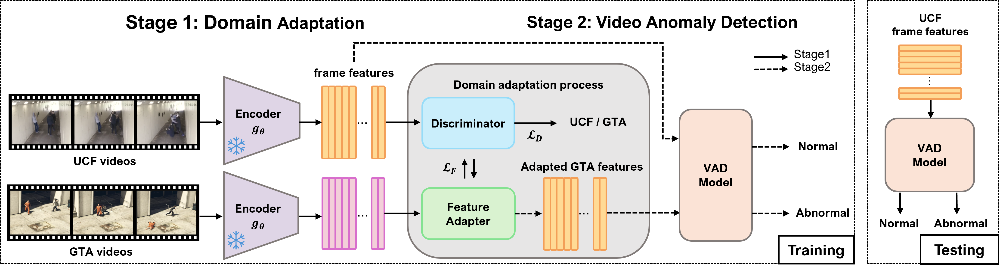

# GTA-Crime
This repo contains the Pytorch implementation of our paper:
> [**GTA-Crime: Leveraging Synthetic Video and Feature-Level Domain Adaptation for Enhanced Fatal Violence Detection**](paper link)
>
> Seongho Kim, Sejong Ryu, Hyoukjun You, Je Hyeong Hong

- **Submitted at ICASSP 2025.**

## Enviroment
- Python 3.12.4
- PyTorch 2.4.0
- Torchvision 0.19.0
- Pytorch-cuda 12.4

## Dataset

**Please download the GTA-Crime dataset from links below:**

> [**GTA-Crime videos on Google Drive**](https://drive.google.com/file/d/14mA5jgSIlfGdE6P-PgOr0bFCOyDSxGhc/view?usp=sharing)

**Extracted I3d and CLIP features for GTA-Crime dataset**
> [**GTA-Crime i3d features on Google Drive**](https://drive.google.com/file/d/14CQoSPS0iRwkTfA8AHcLwImruuUPAUdu/view?usp=sharing)
> 
> [**GTA-Crime CLIP features on Google Drive**](https://drive.google.com/file/d/1fK5B5tJ-dVDSsS8LLawF2hecnMXfBouI/view?usp=sharing)

**We use the extracted I3D and CLIP features for UCF-Crime datasets from the following works:**
> [**UCF-Crime 10-crop I3D features**](https://github.com/Roc-Ng/DeepMIL)
>
> [**UCF-Crime 10-crop CLIP features**](https://github.com/nwpu-zxr/VadCLIP)

## Synthetic Dataset Construction
We extend the code from [GTA5Event](https://github.com/RicoMontulet/GTA5Event) to create fatal scenarios involving stabbing and shooting.

Instructions for creating the dataset are in CONSTRUCTION.md.

## Result on VAD models (AUC)
| Method  |    UCF    | UCF+GTA(w/o DA)|UCF+GTA(w/ WGAN-GP)|UCF+GTA(w/ CycleGAN)|
| ------  | :-------: | :---------: | :-------: | :-------: |
| RTFM    |  85.43    |  84.98  |  87.27 | 87.28|
| UR-DMU  | 86.04 | 81.39  | 86.47 | 86.35 |
| MGFN    | 82.55 | 79.37  | 83.64 | 84.35 |
| CLIP-TSA| 78.75 | 81.62  | 82.66 | 81.65 |
| VadCLIP| 73.59 | 74.60   | 74.79 | 76.84 |
